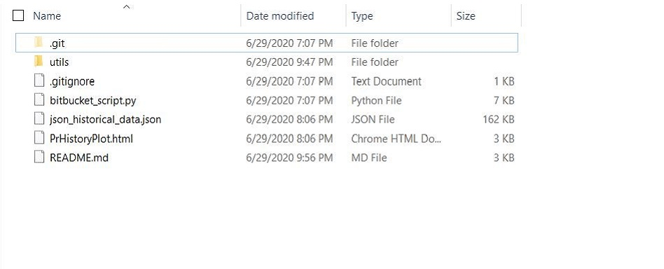
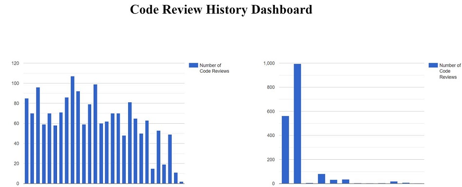

# Bitbucket Code Review Dashboard

## Description
This is a python 3 based script that issues REST APIs to a Bitbucket server to gather and plot total number of pull-requests reviewed by month and by repository name.

## Goal
The target of this project is to learn how to issue rest API calls to a Bitbucket server and gather information. Afterwards, use data gathered to create different kinds of graphs using Google charts.
 
## Expected learning includes but not limited to: 
- Using REST Apis via Python
- Basic HTML, CSS, JavaScript syntax
- Integrating Google Charts inside Python scripts

## Prerequisites
- Knowledge prerequisites:
    - Fundamental python knowledge
        - Classes
        - Functions/Methods
        - Variables
        - Loops
        - Conditional statements
        - Command line arguments
 
- Setup prerequisites:
    - Bitbucket account
    - Python 3: 
        - Install python3 - https://www.python.org/downloads/
        - Add the path to python3.exe to your **PATH** environment variable 
        - Additional Python Modules:
            - atlassian-python-api==1.16.0 - https://pypi.org/project/atlassian-python-api/
            - requests==2.24.0 - https://pypi.org/project/requests/

## Code
Github Repository is linked here: https://github.com/NIAGroup/bitbucket-prHistory

## How To Run The Script
The script runs by invoking the python interpreter + script_name from any command line. 
 
#### Without command line arguments:
python3 bitbucket_script.py
 
or 
 
#### With command line arguments:
python3 bitbucket_script.py -u username -p password
 
## Outcome:
Upon successful execution there will be a JSON and HTML file present in the same directory. 

A user can also serve this html (*PrHistoryPlot.html*) file on the browser of choice to view the plots.

Output Directory Structure        | Bar Graphs (PR/Month & PR/Repo)
:-------------------------:|:-------------------------:
 | 

## Resources
Bitbucket Rest API documentation
- https://atlassian-python-api.readthedocs.io/bitbucket.html
- https://github.com/atlassian-api/atlassian-python-api
- https://docs.atlassian.com/bitbucket-server/rest/5.16.0/bitbucket-rest.html
- https://requests.readthedocs.io/en/master/user/quickstart/
 
Google Charts DataTables and DataViews documentation
- https://developers.google.com/chart/interactive/docs/datatables_dataviews#arraytodatatable
 
Lynda Class on Python Rest APIs
- https://www.linkedin.com/learning/scripting-for-testers/rest-api-calls-from-python?u=2101329
 
Atlassian Python API Wrapper Github Repo
- https://github.com/atlassian-api/atlassian-python-api